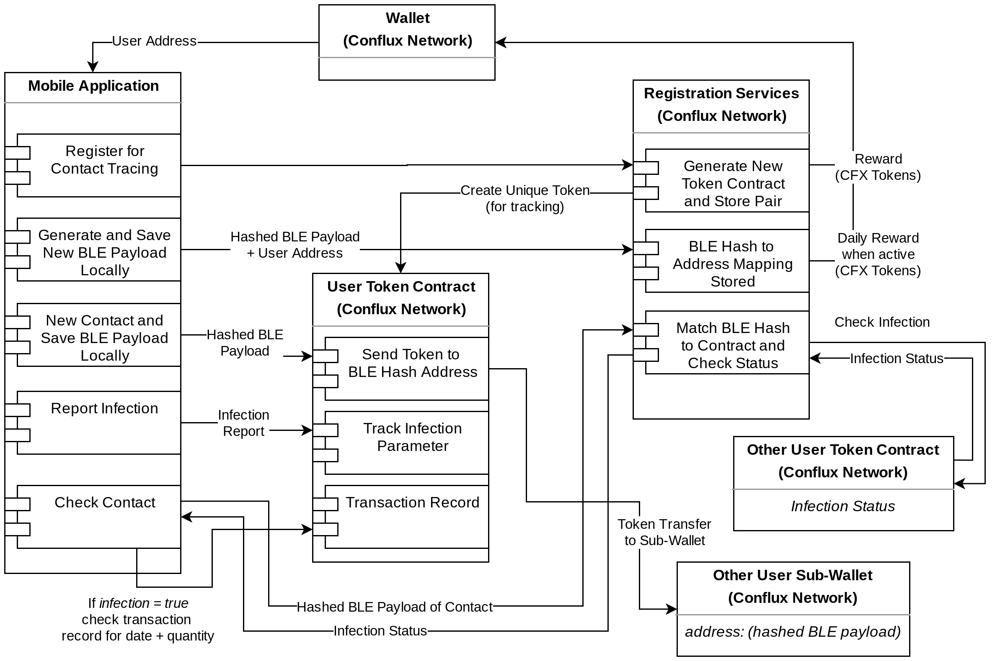
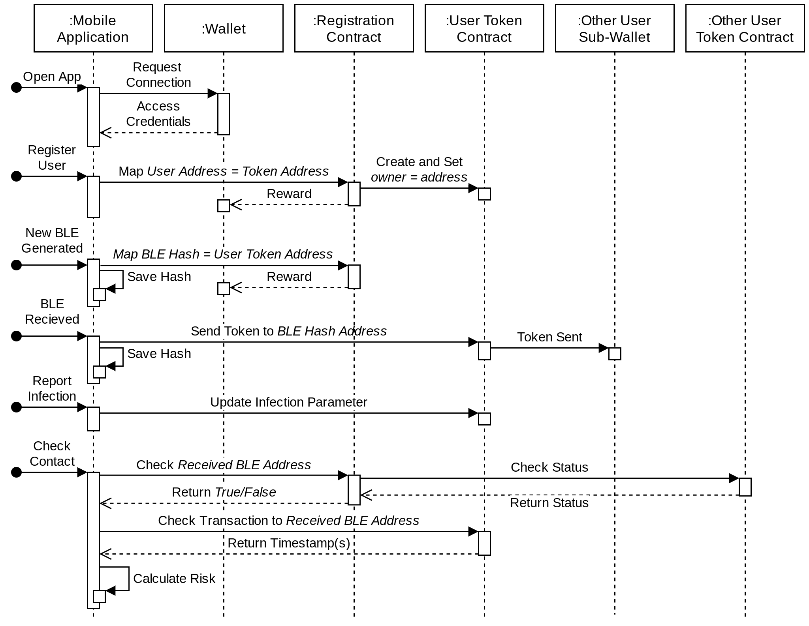

# Contact Tracing DApp PoC
A demonstration of using Conflux Network blockchain network technology as a contact tracing method where tokens are exchanged and used to check for contact with infected individuals.

The key benefits of this technology is privacy and incentive mechanisms. While public blockchains are not known for being private, this method takes away the information from a centralized location. Additionally, if an address is only used for contact tracing, it would be very difficult to match a person with an address.

The other benefit are incentive mechanisms - the difficult answer to how to get individuals to keep using a contact tracing app once the pandemic fears have returned to normal. In this application, users would receive a daily amount of CFX tokens when they register a payload. These tokens have much more use than redeemable reward points or other incentives as can be moved around however a user chooses.

## Technology Structure
At the core are solidity smart contracts.
1. The registration contract is where users first register to get their own tokens, and where they can pass payloads to check for the infection statuses of others.
1. The individual contract is where users can report their own status, and maintain a record of who they have been in contact with.

There is a simple demonstration of the technology in the [demo-front-end](./demo-front-end) as well as a [deployed version](https://conflux-network-global.github.io/contact-tracing/).

_UML diagram illustrating the various connections of the contact-tracing DApp_

The basic concept revolves around the exchange of Bluetooth Low Energy (BLE) payloads similar to the protocols [proposed by Apple and Google](https://www.apple.com/covid19/contacttracing) for privacy conscious contact tracing. However, this method does not rely on two large technology giants who may or may not be mining the information.

The process is as follows:
1. Assuming that all users are registered, they would exchange BLE payloads which are unique and constantly changing.
1. There would be two payloads involved, the personal payload and the contact payload. The user's device would register their own personal payload with the registration contract, and send a token to the hashed address of the contact payload. In this way, there is no direct transactional link between one individuals address and another's.
1. To check the status of contacts, the application would provide their personal payload address and the contact payload address to the registration contract which are both locally stored. This pair allows for validation of contact, because the tokens were exchanged - therefore, the other person should also have a record as an additional check before releasing information.  

_Sequence diagram showing the various processes that occur depending on the interaction type_

## Demo Operation
The current demo implementation requires manual input of all information, but it's goal is to serve as a simple demonstration of what a full application could look like.

1. The user should have [Conflux Portal](https://portal.conflux-chain.org/) installed. Otherwise the first page will prompt them.
1. Once they are connected (approve the web page to connect), the next page allows a user to register.
1. When they register they are given a personal token address that is stored on-chain, and retrieved each time. On the same page, they are able to submit personal payloads and contact payloads. At the very beginning a personal payload must be used before a contact payload can be submitted.
1. At the bottom, there are navigation arrows. And on the next page, it allows a user to track their health as well as check the status of contacts.

## Areas of Improvement
Currently, this is far from a finished product and there are many ways to improve the security and usefulness for the application and the end-user.
- **Higher transaction rates**: While Conflux Network has a high TPS, it needs to be much higher to support widespread adoption. There are two methods of approach: transaction batching, and using a layer-2 scaling solution like Celer.
- **Increase privacy**: Transactions are still visible on Conflux Network, so with enough data mining, it is theoretically possible to "reveal" a user. However, there are many new algorithms that are being applied to mask parts of transactions - such as zero-knowledge proofs (ZKP).
- **Mobile development**: The demo is a web app that does not have access to technology like BLE and the portability of smartphones to facilitate adequate tracking.
- **Plug-in development**: A powerful adaption would be to use this contact tracing method as a plug-in to any app, and make it easy for developers to integrate contact tracing.
- **Better incentive mechanism**: The current incentive mechanism is a daily reward for registering payloads, but there is always room for improved token economics. The trick is to not incentive people to collect as many rewards as possible.
- **Improved infection risk calculation**: Currently, the demo reports if any contact has reported infection, but only in a binary manner. Infection risk could be determined by how long a person was in contact with another person by how many tokens were exchanged.
- **Google/Apple API integration**: Especially during a pandemic, information sharing is crucial for safety - and that means being able to bridge across Web2 and Web3 technologies. Because the proposed blockchain solution and Google/Apple's solution both use BLE technology, a standardized payload would allow for integration across systems.
